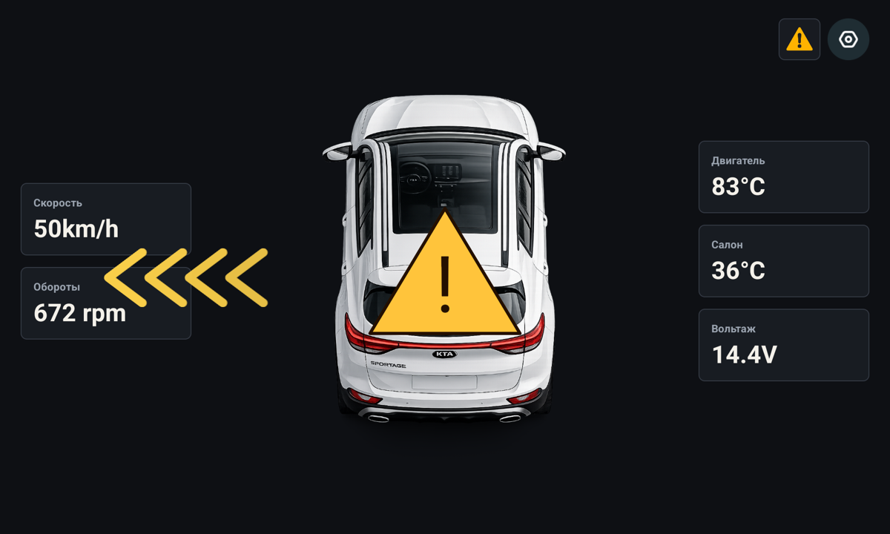
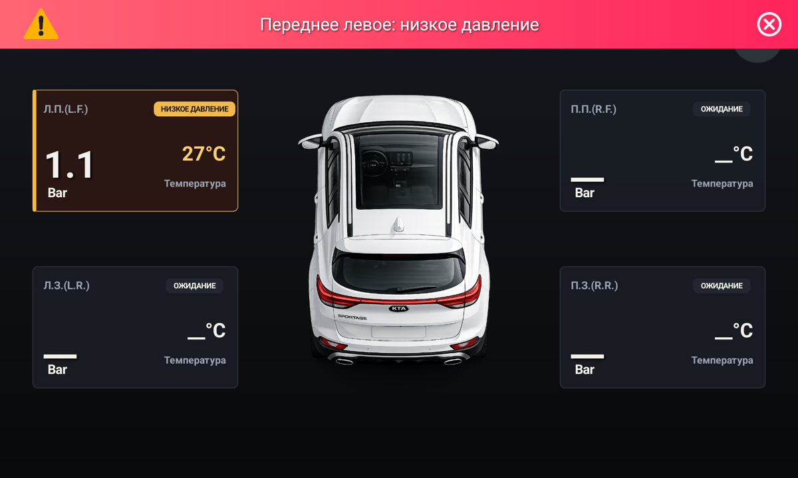
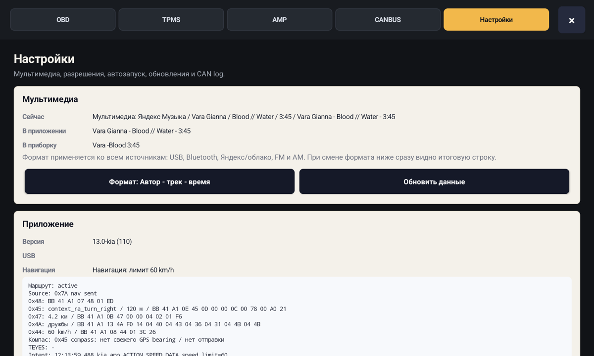
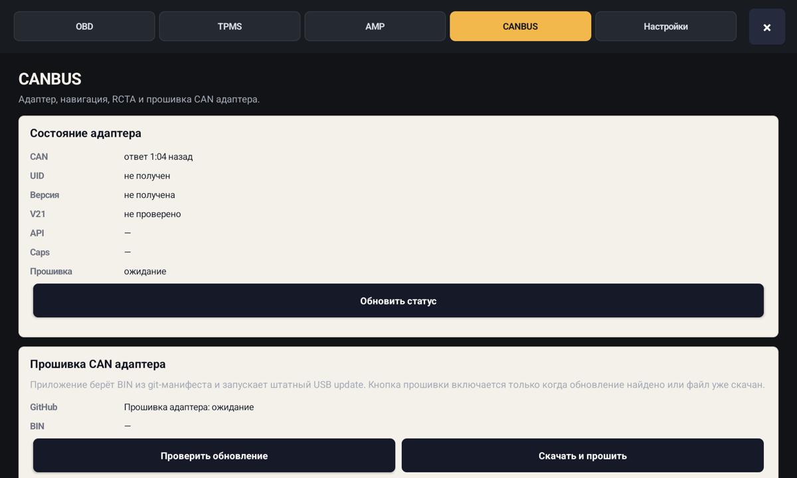
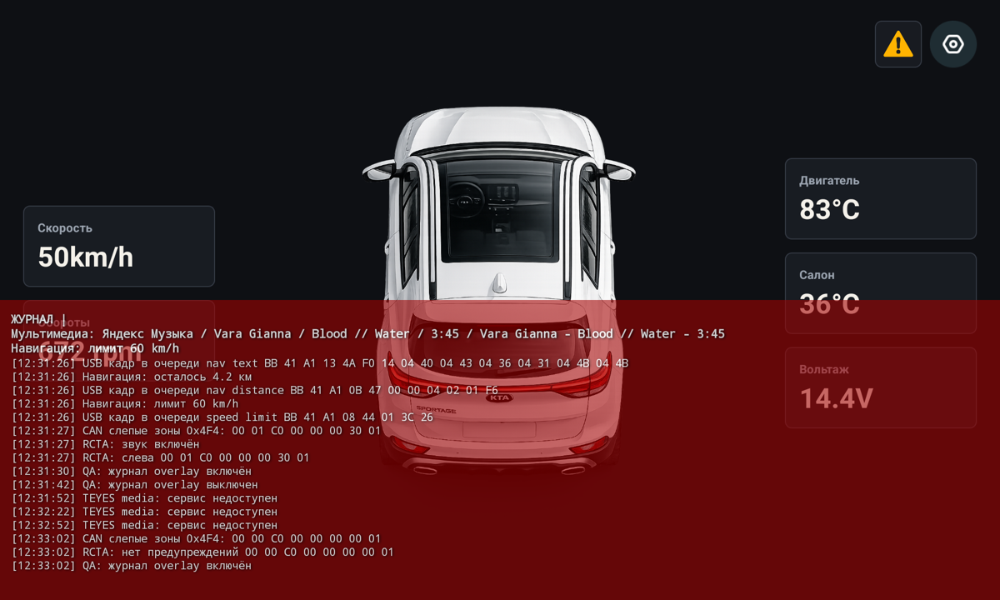

# Kia CANBUS / 2CAN35

Рабочий репозиторий по кастомному 2CAN35/Sigma10 CANBOX на `STM32F105RBT6`
для Kia/Hyundai Sportage.

## Текущий релиз

| Часть | Актуально |
|---|---|
| Android APK | `13.2-kia`, `versionCode 112`, `kia_132.apk` |
| APK artifact | `updates/kia_132.apk` и `/Volumes/SSD/canbus/release/kia_132.apk` |
| APK sha256 | `e1b1018a3b1d5fa24d2091bfeb5a4d191b1b9e943669f3d0d64154ff0e5f38cb` |
| Firmware update channel | `v22-full-raw` |
| Firmware sha256 | `b1256de76cc8c1eabaabefd9f1e77ff4f5988d24a68289514405fa849ce92c4d` |
| Runtime defaults | Vehicle/RCTA/TPMS/media/nav включены, raw CAN/debug/UART/старые тесты выключены |

## Скриншоты APK 13.0

Главный экран:



TPMS:



Настройки мультимедиа и live preview вывода в приборку:



CANBUS/навигация в адаптер:



Журнал поверх экрана:



## Локальная структура

На SSD проект держится одной чистой папкой:

| Путь | Назначение |
|---|---|
| `/Volumes/SSD/canbus/repo` | Этот git-репозиторий. |
| `/Volumes/SSD/canbus/tools` | Локальные toolchain/OpenOCD/SDK, приватные утилиты и рабочие заметки, не git. |
| `/Volumes/SSD/canbus/release` | Готовые APK/прошивки с короткими именами, включая `kia_132.apk`. |

В публичной части репозитория остаются приложение, проверенные CAN-таблицы,
доверенные release-бинарники, hardware/recovery заметки и короткая
документация. Генерируемые APK, live logs, reverse-директории, внутренние
firmware reports, build scripts и описание USB/API обмена в git не хранятся.

## Что лежит в repo

| Папка | Что внутри |
|---|---|
| `android/kia/` | Текущее Android-приложение для TEYES/Kia. |
| `can/` | Подтвержденные CAN-C/M-CAN сигналы и результаты обучения. |
| `dashboard/` | Локальная web/OBD-лаборатория. |
| `docs/` | Hardware/recovery документация и скриншоты. |
| `firmware/` | Доверенные release-бинарники адаптера без публичного описания USB/API протокола. |
| `protocols/raise/` | Обобщенные Raise/RZC UART материалы без приватного контракта адаптера. |
| `protocols/simple_soft/` | Отдельный worklist Simple Soft / `2E` UART. |
| `protocols/teyes_profiles/` | Выжимка из TEYES CANBUS/MS/US APK по профилям и MCU-слоям. |

## Рабочая модель

Штатная прошивка автора работает как `canbox + update`: адаптер читает шины
автомобиля, принимает события от Android/магнитолы и сам конвертирует их в
нужный вывод. Android-приложение не должно использовать raw CAN как основной
путь для media/nav, RCTA или TPMS.

Подробный USB/API протокол, payload-форматы, ACK-коды, адреса hooks, generated
firmware reports и build scripts намеренно вынесены из публичного git. Они
остаются только в локальной рабочей зоне проекта.

## Проверенные факты

- Напряжение в сети найдено на M-CAN-кандидате `0x132`, где значение `0x14`
  соответствует примерно `14.4 V` в проверенном сценарии.
- `0x4F4` в снятых логах относится к парктроникам/заднему препятствию, а не к
  подтвержденному RCTA. RCTA ищется отдельно по M-CAN/full raw логам.
- TPMS нужно ловить в движении: приборка показывает данные после появления
  штатного потока давления/температуры.
- Debug raw capture включается только вручную и не является production-путем
  приложения.

## Сборка Android

```bash
cd /Volumes/SSD/canbus/repo/android/kia
./gradlew assembleRelease
```

После сборки APK автоматически копируется в release-папку с номером версии.

```text
/Volumes/SSD/canbus/release/kia_132.apk
```

Номер в имени берется из `versionName`: `13.2-kia` -> `kia_132.apk`.

## Документы

- [can/confirmed_can_signals.csv](can/confirmed_can_signals.csv)
- [docs/HARDWARE_WIRING_MOD_GUIDE.md](docs/HARDWARE_WIRING_MOD_GUIDE.md)
- [docs/RECOVERY_STLINK_SEQUENCE.md](docs/RECOVERY_STLINK_SEQUENCE.md)

## Что намеренно удалено

- Подробный протокол USB/API обмена с адаптером.
- Firmware build scripts и generated firmware reports.
- Нерабочая чистая C-прошивка.
- Старые `mode3`/`gs_usb` сборки.
- Гигабайты raw live logs.
- APK/reverse decompile dumps.
- Handoff/dist-дубликаты.
- DBC-only таблицы как рабочая документация.

Если нужно снова исследовать старую гипотезу, ее лучше поднять из приватной
локальной зоны или истории git, а в текущей ветке держать только то, что можно
публиковать.
