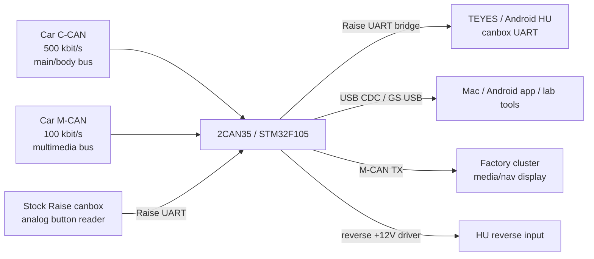
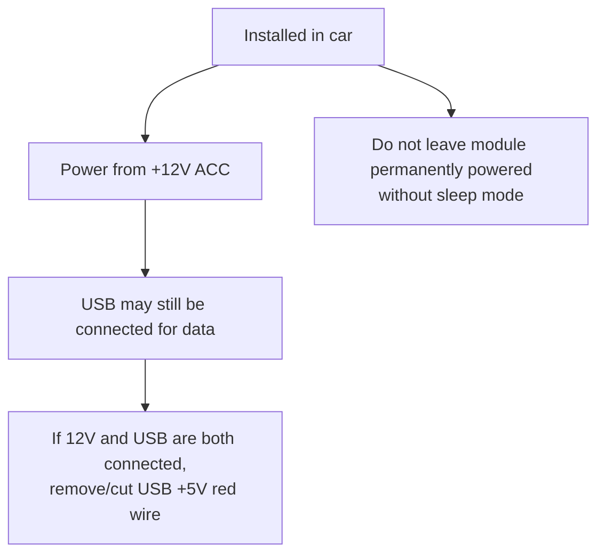
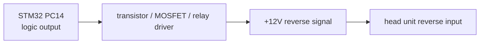

# Hardware Wiring And 2CAN35 Rework Guide

This is the project-specific wiring guide for the StarLine/2CAN35 board used as
a Kia/Hyundai two-CAN canbox.

Main source adapted here:

- Drive2 article: https://www.drive2.ru/l/717368666034802531/

Do not treat this file as a factory schematic. It is an installation/rework map
based on the Drive2 guide, our board photos, firmware reverse work and the
current `firmware/custom_c` pin map.

## Target Architecture



Key idea:

- the car needs both CAN buses for full functionality;
- analog steering wheel buttons and piano-panel buttons stay on the stock Raise
  canbox path;
- our adapter sits between the stock Raise UART and the head unit UART;
- the head unit still sees the Raise protocol, so button conversion is not
  required for the basic path.

## Current Signal Map

| Signal / connector | Direction | Connect to | Purpose | Status |
|---|---|---|---|---|
| `+12V ACC` | car -> adapter | ACC-switched 12 V | Main adapter power when installed in car | required |
| `GND` | car/HU -> adapter | car ground and HU UART ground | Common reference for CAN/UART/12 V | required |
| USB `VBUS/D+/D-/GND` | Mac/HU -> adapter | native micro-USB | update, logger, dashboard/lab commands | confirmed |
| C-CAN H/L | car <-> adapter | main/body CAN, 500 kbit/s | body, reverse, speed, parking, climate candidates | confirmed speed |
| M-CAN H/L | car <-> adapter | multimedia CAN, 100 kbit/s | cluster media/nav/status frames | confirmed speed |
| UART2 TX/RX | adapter <-> HU/Raise | STM32 USART2 `PA2/PA3`, 19200 8N1 | Raise protocol / future transparent button bridge | confirmed MCU pins, bridge not complete |
| Reverse output control | adapter -> driver | `PC14` controls external transistor/relay path | +12 V reverse signal to HU | implemented in clean C, verify driver path |
| ST-Link SWDIO/SWCLK | programmer <-> adapter | `PA13/PA14` | recovery/full flash | confirmed |
| NRST | programmer -> adapter | MCU reset | connect-under-reset recovery | confirmed |
| BOOT0 | programmer/user -> adapter | BOOT0 high when needed | system bootloader/recovery experiments | confirmed MCU pin |

## CAN Bus Assignment

From the Drive2 guide and comments:

| Adapter pair in that guide | Bus | Speed | Notes |
|---|---|---:|---|
| Orange pair | M-CAN / multimedia | 100 kbit/s | Must stay on the multimedia bus. |
| Brown pair | C-CAN / main | 500 kbit/s | Must stay on the main/body bus. |

Important:

- do not swap C-CAN and M-CAN;
- observe CAN-H and CAN-L polarity;
- the buses have different speeds and different data;
- color names above are the adapter harness colors from the referenced guide,
  not a universal vehicle harness standard.
- if a connector is labelled only `CAN1/CAN2`, verify by harness color, bitrate
  and traffic, not by the label alone.

Our firmware naming:

| Firmware bus | MCU pins | Speed | Practical meaning |
|---|---|---:|---|
| C-CAN | CAN1 remap `PB8 RX / PB9 TX` | 500 kbit/s | main/body bus |
| M-CAN | CAN2 `PB12 RX / PB13 TX` | 100 kbit/s | multimedia bus |

## Power Rules



Drive2 notes adapted for this project:

- the board can be powered from 12 V or from USB;
- if the car installation uses 12 V and USB simultaneously, remove USB power
  from the cable and keep only USB data/ground;
- use ACC-switched 12 V for normal installation;
- the referenced author measured roughly 50 mA consumption, so permanent power
  without sleep mode can drain the battery.

## UART Rework From The Drive2 Guide

Terminology warning:

- in our firmware docs, `UART2` means STM32 `USART2` on `PA2/PA3`;
- in the Drive2 article, "second UART" means a second externally exposed UART
  channel on the board. These are not the same naming layer.

### Primary HU/Raise UART

The Drive2 guide implements the primary UART using pads originally routed as
`Output (+/-)`.

Adapted steps:

1. Work only with power disconnected.
2. Remove the marked output-driver/passive parts for that output pair.
3. Install two series resistors, nominal `100 ohm`, in the UART TX/RX lines.
4. Add the two jumpers shown in the original Drive2 photos.
5. Do not add extra pull-ups unless measurement proves they are needed; the
   referenced build relies on pull-ups already present in the head unit path.
6. Connect UART ground to the HU canbox UART ground.

Drive2 wire color notes for that primary UART:

| Wire color in article | Function |
|---|---|
| Blue-red | TX |
| Yellow-red | RX |

For our target chain:

```text
stock Raise canbox TX -> our adapter UART2 RX
stock Raise canbox RX <- our adapter UART2 TX
our adapter UART2 TX/RX -> TEYES canbox UART path through bridge firmware
GND must be common
```

Before connecting to the head unit:

- idle TX should measure around 3.3 V if the interface is configured;
- RX may sit near 0 V before the other side drives it;
- if TX/RX are swapped, button/HU communication will not work, but this usually
  should not damage the UART if the levels are 3.3 V TTL.
- resistor package size must be chosen from the actual footprint; Drive2
  comments mention small `0402` parts and larger `1206` parts, but the board
  revision/footprint must decide what is fitted.

### Optional Second Exposed UART

The Drive2 guide also shows an optional second UART rework:

1. Remove the parts marked as group `3`.
2. Install two `100 ohm` series resistors.
3. Add two jumpers.

Drive2 wire color notes for that optional UART:

| Wire color in article | Function |
|---|---|
| Black-red | TX |
| Orange-violet | RX |

For this project, this optional second exposed UART is not required for the
first Raise-button bridge. Use it only if we later need another in-line device
or a second debug/bridge channel.

## Optional CAN Blocking / Pull-Up Area

The Drive2 article describes the parts marked group `1` as original circuitry
for CAN-line pull-up/blocking style functions. For the author's use case they
were not needed and could be removed optionally.

Project rule:

- do not remove parts just because the article removed them;
- if the board already works and the path is not used, leave it unless it
  blocks the UART/CAN rework;
- document every removed part with a photo and continuity result.

## Reverse Output

Our clean firmware uses `PC14` only as a logic control signal. Do not drive a
12 V reverse input directly from `PC14`.

Recommended path:



Status:

- reverse output control is implemented in `firmware/custom_c`;
- exact board driver path must be verified with a meter;
- physical reverse input pin is not confirmed yet.

## Minimal Car Connection Checklist

For a basic installed adapter:

| Required | Connect |
|---|---|
| Power | `+12V ACC`, `GND` |
| C-CAN | C-CAN H/L, 500 kbit/s, main bus |
| M-CAN | M-CAN H/L, 100 kbit/s, multimedia bus |
| HU UART | TX, RX, GND to TEYES/Raise canbox UART path |
| USB | data connection for update/logger/dashboard; cut USB +5 V if 12 V is also used |

Minimum practical harness from the Drive2 comments:

```text
GND, +12V ACC, M-CAN H/L, C-CAN H/L, UART RX, UART TX
```

Duplicate ground into the head-unit UART connector. Remove unused wires from the
harness only after the required functions are verified.

For development/recovery:

| Required | Connect |
|---|---|
| ST-Link | SWDIO, SWCLK, GND, VTref/3.3 V sense |
| Reset | NRST for connect-under-reset |
| Optional boot | BOOT0 high only when intentionally using system boot mode |

## Bench Test Order

1. Before rework, verify the stock module is visible to StarLine/USB tooling and
   can be updated.
2. After UART rework, check for shorts between TX/RX/GND/3.3 V/12 V.
3. Measure UART idle levels: TX near 3.3 V, RX depends on the connected side.
4. Power from USB only and confirm USB enumeration.
5. Power from ACC 12 V and confirm current draw is reasonable.
6. Connect only one CAN bus first and verify logger sees traffic at the expected
   speed.
7. Connect both CAN buses and verify channel mapping.
8. Add HU/Raise UART and verify analog buttons pass through.
9. Test reverse output with a meter before connecting it to the HU reverse input.

## Photo And Scheme References

Original Drive2 page:

- https://www.drive2.ru/l/717368666034802531/

Original images referenced by that page:

| What | Link |
|---|---|
| Vehicle CAN scheme | https://a1.drive-data.ru/Mt_GxNhIEKz6oCyHlecd9wg32yQ-1920.jpg |
| 2CAN35 board photo 1 | https://a1.drive-data.ru/YI2nYZN-BAAg4mGF6guiZk40FRo-1920.jpg |
| 2CAN35 board photo 2 | https://a1.drive-data.ru/mr3-p_CzqgV95TZacvW5OSgE2Fs-1920.jpg |
| Group 1 before | https://a1.drive-data.ru/fxwGfPkk8M5FEqRr867ToNZfG6w-1920.jpg |
| Group 1 after | https://a1.drive-data.ru/rwHwkrb2fx4-cQ1hXufm6mlvBaU-1920.jpg |
| Primary UART before | https://a1.drive-data.ru/RVPRJbjWlLxw-Usy9BUbfh7HXEA-1920.jpg |
| Primary UART after | https://a1.drive-data.ru/gxaOXqkfqaV8i5KtcrMA0-fZmFA-1920.jpg |
| Optional UART parts | https://a1.drive-data.ru/h4GBA4GVSZsbmgrFkNK_hMJam8s-1920.jpg |
| Optional UART jumpers | https://a1.drive-data.ru/5MuUt3_gIw1TyRC6TH7SM5va_ec-1920.jpg |
| Generic reference schematic from article | https://we.easyelectronics.ru/uploads/images/00/56/67/2021/03/06/13902e.jpg |

Other references:

- StarLine 2CAN-35 install PDF from the Drive2 article:
  https://store.starline.ru/upload/iblock/af9/StarLine_2CAN_35_install.pdf
- Kia/Hyundai manual link from the Drive2 article:
  https://gds-manuals.ru/kme-xm12.html
- STM32F105 datasheet:
  https://www.st.com/resource/en/datasheet/stm32f105rb.pdf
